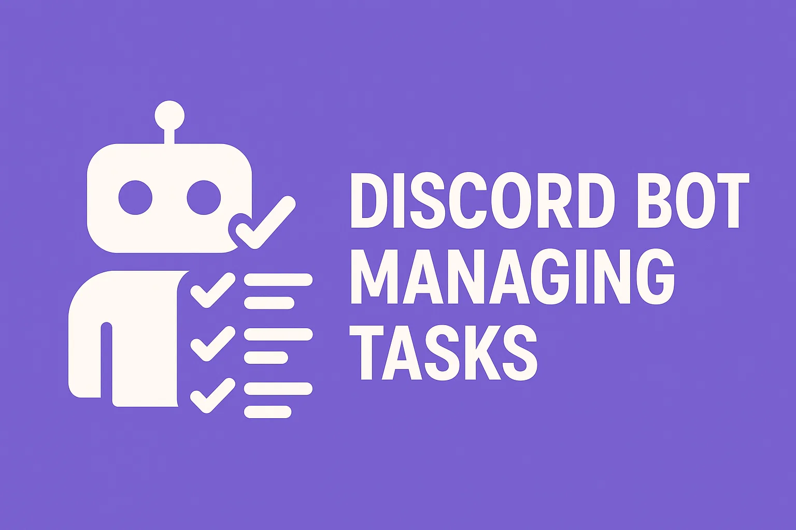
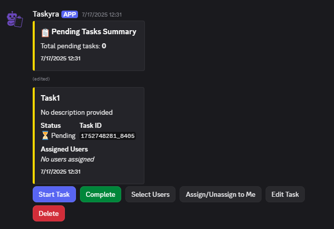
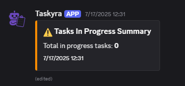
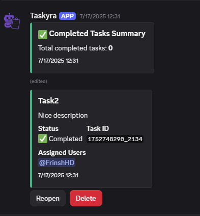

# Taskyra

Taskyra is an easy-to-use Discord bot that helps you manage tasks on your server. It allows you to organize tasks
directly within your Discord server. Perfect for project-related collaboration!

## Features

- Create, assign and update tasks
- Easily manage a task with buttons so you don't need to remember commands
- Easily deploy your own instance with Docker and Docker Compose

## Getting Started

### Prerequisites

- [Docker](https://www.docker.com/get-started)
- [Docker Compose](https://docs.docker.com/compose/)
- A Discord bot token ([How to create a bot](https://discord.com/developers/applications))

### Installation

#### Use Our Hosted Instance

You can use the official Taskyra bot without self-hosting. Simply invite it to your server using this link:
[Invite Taskyra](https://discord.com/oauth2/authorize?client_id=1392819837465657394)

#### Self-hosted

1. Clone the repository:
    ```sh
    git clone https://github.com/FrinshHD/Taskyra.git
    cd Taskyra
    ```
2. Copy and configure environment variables:
   ```sh
   cp .env.example .env
   ```
3. Start Taskyra using Docker Compose:
   ```sh
   docker-compose up -d --build
   ```

## Usage

### Slash Commands

- `/posttask` - Create a new task.
- `/settaskchannels` - Configure which channels Taskyra uses.

### Buttons

- `Start` - Put a task in the inprogress category.
- `Complete` - Mark a task as completed.
- `Delete` - Delete a task.
- `Assign/Unassign Me` - Assign or unassign yourself to/from the task.
- `Assign User` - Assign a user to the task using a modal.
- `Edit Task` - Edit the task name and description using a modal.

### Showcase



